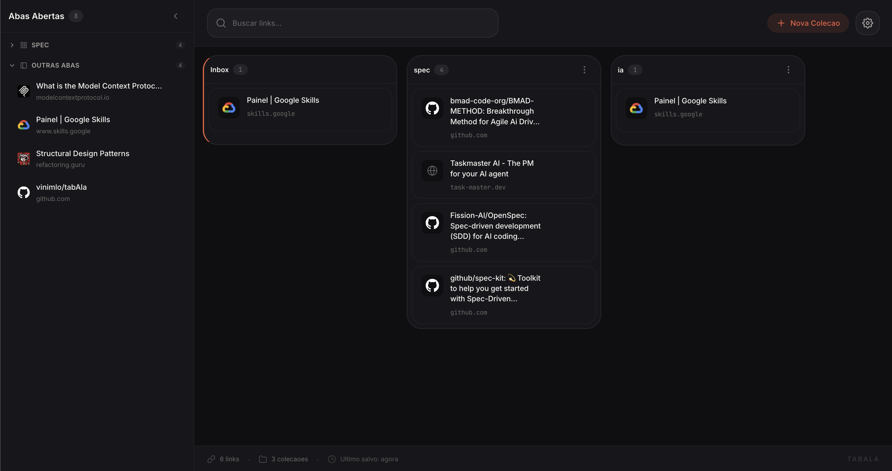

# TabAla

> Salve abas. Organize em coleções. Processe quando quiser.

## Features

- Salve a aba atual com um clique
- Organize links em coleções personalizadas
- Inbox automático para links sem coleção
- Dashboard no New Tab para visão completa
- Funciona 100% offline (armazenamento local)

## Screenshots

  

## Instalação

<!--
### Chrome Web Store (em breve)
[Instalar TabAla](link-da-store)
-->

### Manual

1. Baixe a [última release](https://github.com/vinimlo/tabAla/releases)
2. Acesse `chrome://extensions`
3. Ative "Modo desenvolvedor"
4. Clique em "Carregar sem compactação"
5. Selecione a pasta `dist/`

## Contribuindo

Quer contribuir? Veja o [guia de contribuição](CONTRIBUTING.md).

## Licença

[Apache 2.0](LICENSE)
