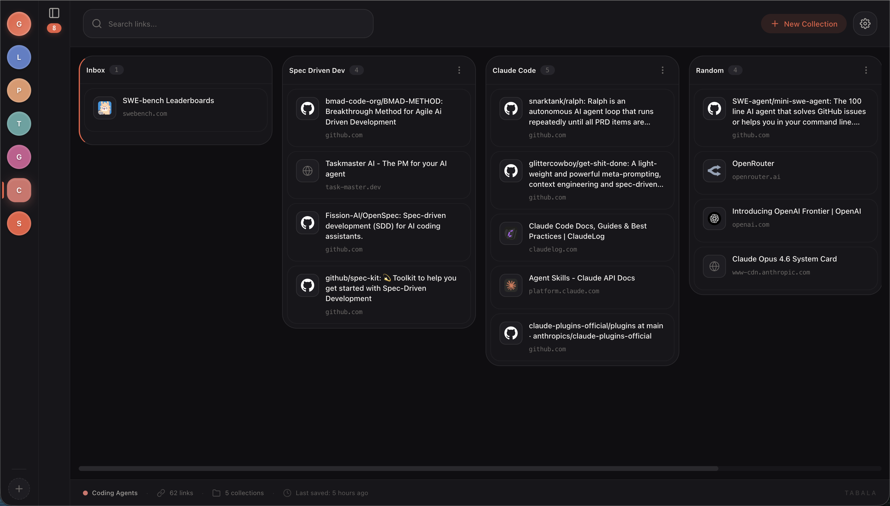

English | [Português (Brasil)](README.pt-BR.md)

# TabAla

Save tabs. Organize in collections. Process when you want.

## Features

- Save the current tab with one click
- Organize links into custom collections
- Automatic Inbox for uncategorized links
- New Tab dashboard for a complete overview
- Works 100% offline (local storage)

## Screenshots

## Installation

### Chrome Web Store (Recommended)

Click the button above or visit the [Chrome Web Store page](https://chromewebstore.google.com/detail/tabala/ndnejipljgocfklehcimajinhamjkgjh) to install TabAla with one click.

### Manual Installation

1. Download the [latest release](https://github.com/vinimlo/tabAla/releases)
2. Go to `chrome://extensions`
3. Enable "Developer mode"
4. Click "Load unpacked"
5. Select the `dist/` folder

## Contributing

Want to contribute? See the [contributing guide](CONTRIBUTING.md).

## License

[Apache 2.0](LICENSE)
