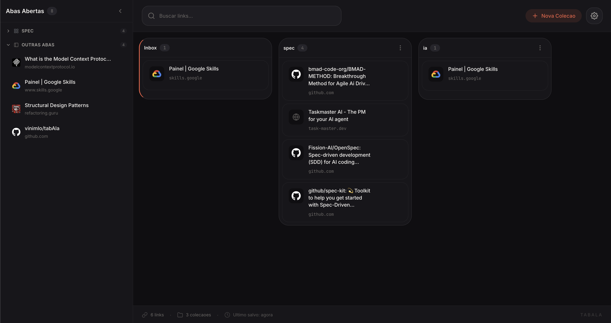

*English | [Portugues (Brasil)](README.pt-BR.md)*

# TabAla

> Save tabs. Organize in collections. Process when you want.

## Features

- Save the current tab with one click
- Organize links into custom collections
- Automatic Inbox for uncategorized links
- New Tab dashboard for a complete overview
- Works 100% offline (local storage)

## Screenshots

  

## Installation

<!--
### Chrome Web Store (coming soon)
[Install TabAla](store-link)
-->

### Manual

1. Download the [latest release](https://github.com/vinimlo/tabAla/releases)
2. Go to `chrome://extensions`
3. Enable "Developer mode"
4. Click "Load unpacked"
5. Select the `dist/` folder

## Contributing

Want to contribute? See the [contributing guide](CONTRIBUTING.md).

## License

[Apache 2.0](LICENSE)
